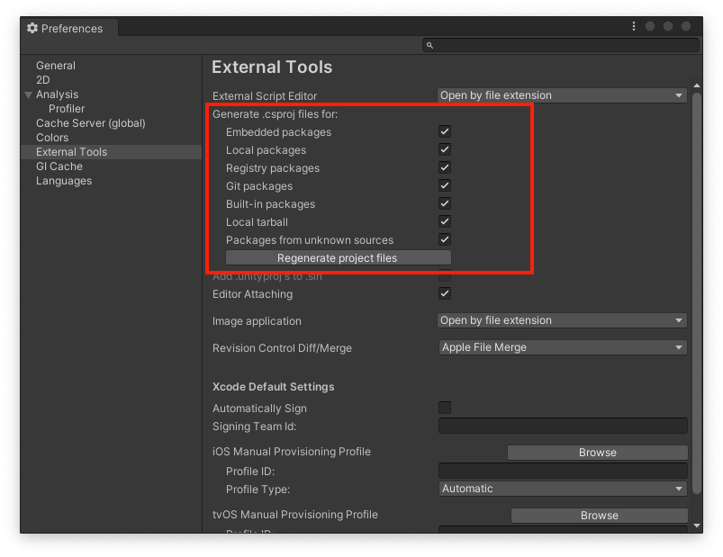

# sample-bug-unity

## How to reproduce the bug
1. Open file ``Assets > sample.cs``
2. Please follow the instructions in the comments.

## If that doesn't work, try the following
1. Install Unity
2. Open this project with Unity
3. Execute the following commands at the root of the project
`` rm -rf *.csproj sample-bug-unity.sln``
4. Unity > Preferences > Extemal Tools
6. Check the box as shown in the next image.

5. Click "Regenerate project files" button

